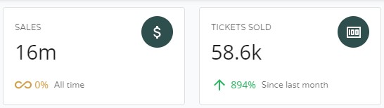
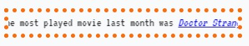
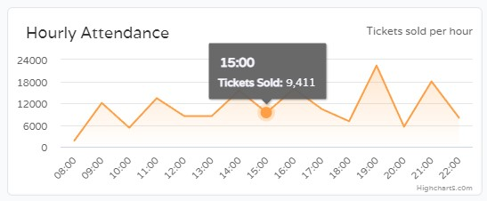

<div id="top"></div>
<!--
*** Thanks for checking out the Best-README-Template. If you have a suggestion
*** that would make this better, please fork the repo and create a pull request
*** or simply open an issue with the tag "enhancement".
*** Don't forget to give the project a star!
*** Thanks again! Now go create something AMAZING! :D
-->


<!-- PROJECT SHIELDS -->
<!--
*** I'm using markdown "reference style" links for readability.
*** Reference links are enclosed in brackets [ ] instead of parentheses ( ).
*** See the bottom of this document for the declaration of the reference variables
*** for contributors-url, forks-url, etc. This is an optional, concise syntax you may use.
*** https://www.markdownguide.org/basic-syntax/#reference-style-links
-->
[![Contributors][contributors-shield]][contributors-url]
[![Forks][forks-shield]][forks-url]
[![Stargazers][stars-shield]][stars-url]
[![Issues][issues-shield]][issues-url]
[![MIT License][license-shield]][license-url]
[![LinkedIn][linkedin-shield]][linkedin-url]


<!-- PROJECT LOGO -->
<br />
<div align="center">
  <a href="https://hongkong-cinemasdashboard.netlify.app/about" target="_blank">
    
  </a>

<h2 align="center">📊 Hong Kong Cinemas Dashboard</h2>

  <p align="center">
	An interactive dashboard made with real-world data to visualize cinemas' popular times, sales, and seat popularity.
    <br />
    <a href="https://github.com/tophersss/HongKong-CinemasScrapers" target="_blank"><strong>Explore the docs »</strong></a>
    <br />
    <br />
    <a href="https://hongkong-cinemasdashboard.netlify.app/about" _target="blank">View Demo</a>
    ·
    <a href="https://github.com/tophersss/HongKong-CinemasDashboard/issues" target="_blank">Report Bug</a>
    ·
    <a href="https://github.com/tophersss/HongKong-CinemasDashboard/issues">Request Feature</a>
  </p>
</div>


<!-- TABLE OF CONTENTS -->
<details>
  <summary>Table of Contents</summary>
  <ol>
    <li>
      <a href="#about-the-repository">About The Repository</a>
    </li>
    <li>
        <a href="#data-used">Data Used</a>
    </li>
    <li>
        <a href="#technologies-used">Technologies Used</a>
    </li>
    <li>
      <a href="#getting-started">Getting Started</a>
      <ul>
        <li><a href="#prerequisites">Prerequisites</a></li>
        <li><a href="#installation">Installation</a></li>
      </ul>
    </li>
    <li>
        <a href="#Approach">Approach</a>
    </li>
    <li><a href="#license">License</a></li>
    <li><a href="#contact">Contact</a></li>
    <li><a href="#acknowledgments">Acknowledgments</a></li>
  </ol>
</details>


<!-- ABOUT THE REPOSITORY -->
<div id="about-the-repository"></div>

## 🧐 About The Repository

A dashboard was created to explore the trends of the industry - including popular times, sales, and seat popularity. Cinemas were pinned to a map so that it shows see how they are spread out across the city.

Up and running: [https://hongkong-cinemasdashboard.netlify.app/about](https://hongkong-cinemasdashboard.netlify.app/about)

<p align="right">(<a href="#top">back to top</a>)</p>


<!-- DATA USED -->
<div id="data-used"></div>

## 📚  Data Used


Data were collected from over 123,000 shows and 445 movies and stored in an SQLite database. Learn more in this [repo](https://github.com/tophersss/HongKong-CinemasScrapers). 

To make life easier, a database view `vShowDetails` was created to aggregate shows and calculate number of tickets sold and sales made. SQL query results were then exported as a JavaScript object to be used by the website.

See below for the queries used:


<details> 
<summary>sql</summary>

```sql
SELECT
    b.theatreID 
    , a.theatre as 'theatreTC'
    , b.name_en as 'theatreEN'
    , SUM(a.profit) as 'OverallSales'
    , SUM(CASE WHEN strftime('%Y-%m', a.movie_starttime) = strftime('%Y-%m', 'now') AND a.theatre IS NOT NULL THEN a.profit ELSE 0 END) as 'CurrentMonthSales'
    , SUM(CASE WHEN strftime('%Y-%m', a.movie_starttime) = strftime('%Y-%m', 'now', '-32 days') AND a.theatre IS NOT NULL THEN a.profit ELSE 0 END) as 'PrevMonthSales'
    , SUM(CASE WHEN strftime('%W', a.movie_starttime) = strftime('%W', 'now') THEN a.profit ELSE 0 END) as 'CurrentWeekSales'
    , SUM(CASE WHEN strftime('%W', a.movie_starttime) = strftime('%W', 'now', '-7 days') THEN a.profit ELSE 0 END) as 'PrevWeekSales'
    , SUM(a.ticket_sold) as 'OverallTicketsSold'
    , SUM(CASE WHEN strftime('%Y-%m', a.movie_starttime) = strftime('%Y-%m', 'now') THEN a.ticket_sold ELSE 0 END) as 'CurrentMonthTicketsSold'
    , SUM(CASE WHEN strftime('%Y-%m', a.movie_starttime) = strftime('%Y-%m', 'now', '-32 days') THEN a.ticket_sold ELSE 0 END) as 'PrevMonthTicketsSold'
    , SUM(CASE WHEN strftime('%W', a.movie_starttime) = strftime('%W', 'now') THEN a.ticket_sold ELSE 0 END) as 'CurrentWeekTicketsSold'
    , SUM(CASE WHEN strftime('%W', a.movie_starttime) = strftime('%W', 'now', '-7 days') THEN a.ticket_sold ELSE 0 END) as 'PrevWeekTicketsSold'
FROM vShowDetails as a
INNER JOIN Theatres as b on a.theatre = b.name
WHERE a.theatre is not null
GROUP BY a.theatre
```
</details>

<br>


<details> 
<summary>sql</summary>

```sql
WITH 
crowded_session AS (
select
    a.TheatreID
    , a.weekday
    , strftime('%H', a.movie_starttime) as 'hh'
    , SUM(a.ticket_sold)
    , ROW_NUMBER() OVER(PARTITION BY a.theatreID ORDER BY SUM(a.ticket_sold) desc) as 'rnk'
from vShowDetails as a 
group by a.theatreID, a.weekday, strftime('%H', a.movie_starttime)
) ,
movie_cnt AS (
select
    a.theatreID
    , SUM( CASE WHEN strftime('%Y-%m', a.movie_starttime) = strftime('%Y-%m', 'now', '-32 days') THEN 1 ELSE 0 END ) as 'cnt'
from vShowDetails as a 
group by a.theatreID
) ,
cheapest_ticket AS (
select
    a.TheatreID
    , a.weekday
    , strftime('%H', a.movie_starttime) as 'hh'
    , AVG(price) as 'avg_price'
    , ROW_NUMBER() OVER(PARTITION BY a.theatreID ORDER BY AVG(price)) as 'rnk'
from vShowDetails as a 
group by a.theatreID, a.weekday, strftime('%H', a.movie_starttime)
) ,
top_movie AS (
select
    a.TheatreID
    , a.movieID
    , a.hkmovie6_code
    , a.name_en
    , SUM( CASE WHEN strftime('%Y-%m', a.movie_starttime) = strftime('%Y-%m', 'now', '-32 days') THEN 1 ELSE 0 END ) as 'cnt'
    , ROW_NUMBER() OVER(PARTITION BY a.theatreID ORDER BY SUM( CASE WHEN strftime('%Y-%m', a.movie_starttime) = strftime('%Y-%m', 'now', '-32 days') THEN 1 ELSE 0 END ) desc) as 'rnk'
from vShowDetails as a 
group by a.theatreID, a.movieID, a.hkmovie6_code, a.name_en
)
SELECT
    a.TheatreID
    , a.weekday as 'crowd_day'
    , a.hh as 'crowd_hh'
    , b.cnt as 'movie_cnt_last_month'
    , c.weekday as 'cheap_day'
    , c.hh as 'cheap_hh'
    , c.avg_price as 'cheap_avg_price'
    , d.movieID as 'most_played_movieID'
    , d.hkmovie6_code as 'most_played_hkmovie6_code'
    , d.name_en as 'most_played_name_en'
    , d.cnt as 'most_played_cnt'
FROM crowded_session as a 
INNER JOIN movie_cnt as b on a.TheatreID = b.TheatreID
INNER JOIN cheapest_ticket as c on a.TheatreID = c.TheatreID and c.rnk = 1
INNER JOIN top_movie as d on a.TheatreID = d.TheatreID and d.rnk = 1
WHERE a.rnk = 1
AND a.TheatreID is not null
```
</details>

<br>


<details> 
<summary>sql</summary>

```sql
SELECT * FROM (
SELECT
    main.theatre
    , main.theatreID
    , CASE main.hh
        WHEN '08:00' THEN 0
        WHEN '09:00' THEN 1
        WHEN '10:00' THEN 2
        WHEN '11:00' THEN 3
        WHEN '12:00' THEN 4
        WHEN '13:00' THEN 5
        WHEN '14:00' THEN 6
        WHEN '15:00' THEN 7
        WHEN '16:00' THEN 8
        WHEN '17:00' THEN 9
        WHEN '18:00' THEN 10
        WHEN '19:00' THEN 11
        WHEN '20:00' THEN 12
        WHEN '21:00' THEN 13
        WHEN '22:00' THEN 14
        WHEN '23:00' THEN 15
        WHEN '24:00' THEN 16
        WHEN '01:00' THEN 17
    ELSE -1
    END as 'label'
    , main.hh
    , SUM(ticket_sold) as 'ticket_sold'
    , SUM(capacity) as 'available_seats'
    , (SUM(ticket_sold) * 1.0 / SUM(capacity) ) as 'occupancy'
    , SUM(profit) as 'profit'
    , COUNT(*) as 'nob'
    , CASE WHEN main.hh = '01:00' THEN 2 ELSE 1 END as 'sortVal'
FROM (
    SELECT
        a.theatre, a.theatreID
        , replace(strftime('%H:00', a.movie_starttime), '00:00', '24:00') as 'hh', a.ticket_sold, a.capacity, a.profit
    FROM vShowDetails as a
    INNER JOIN Showtimes as b on a.ShowtimeID = b.ShowtimeID
    INNER JOIN Movies as c on a.MovieID = c.MovieID
    WHERE a.price is not null
) main
WHERE main.hh is not null
GROUP BY main.theatre, main.hh
) final
ORDER BY theatre, sortVal, hh
```
</details>

<br>


<details> 
<summary>sql</summary>

```sql
SELECT 
	a.house_name
	, a.house_alias1
	, a.houseid
	, a.theatre
	, a.theatre_en
	, a.theatreid
	, AVG(price) AS 'avg_price'
	, SUM(profit) as 'profit'
	, SUM(ticket_sold) as 'ticket_sold'
	, MIN(CAPACITY) as 'capacity'
	, count(*) as 'nob'
FROM vShowDetails as a
WHERE a.price is not null
GROUP BY a.house_name, a.house_alias1, a.houseid, a.theatre, a.theatre_en, a.theatreid
ORDER BY theatreid, profit desc
```
</details>

<br>


<details> 
<summary>sql</summary>

```sql
SELECT
    b.theatreID 
    , a.theatre as 'theatreTC'
    , b.name_en as 'theatreEN'
    , SUM(a.profit) as 'OverallSales'
    , SUM(CASE WHEN strftime('%Y-%m', a.movie_starttime) = strftime('%Y-%m', 'now') AND a.theatre IS NOT NULL THEN a.profit ELSE 0 END) as 'CurrentMonthSales'
    , SUM(CASE WHEN strftime('%Y-%m', a.movie_starttime) = strftime('%Y-%m', 'now', '-32 days') AND a.theatre IS NOT NULL THEN a.profit ELSE 0 END) as 'PrevMonthSales'
    , SUM(CASE WHEN strftime('%W', a.movie_starttime) = strftime('%W', 'now') THEN a.profit ELSE 0 END) as 'CurrentWeekSales'
    , SUM(CASE WHEN strftime('%W', a.movie_starttime) = strftime('%W', 'now', '-7 days') THEN a.profit ELSE 0 END) as 'PrevWeekSales'
    , SUM(a.ticket_sold) as 'OverallTicketsSold'
    , SUM(CASE WHEN strftime('%Y-%m', a.movie_starttime) = strftime('%Y-%m', 'now') THEN a.ticket_sold ELSE 0 END) as 'CurrentMonthTicketsSold'
    , SUM(CASE WHEN strftime('%Y-%m', a.movie_starttime) = strftime('%Y-%m', 'now', '-32 days') THEN a.ticket_sold ELSE 0 END) as 'PrevMonthTicketsSold'
    , SUM(CASE WHEN strftime('%W', a.movie_starttime) = strftime('%W', 'now') THEN a.ticket_sold ELSE 0 END) as 'CurrentWeekTicketsSold'
    , SUM(CASE WHEN strftime('%W', a.movie_starttime) = strftime('%W', 'now', '-7 days') THEN a.ticket_sold ELSE 0 END) as 'PrevWeekTicketsSold'
FROM vShowDetails as a
INNER JOIN Theatres as b on a.theatre = b.name
WHERE a.theatre is not null
GROUP BY a.theatre
```
</details>


<p align="right">(<a href="#top">back to top</a>)</p>


<!-- TECHNOLOGIES USED -->
<div id="technologies-used"></div>

## 👨‍💻  Technologies Used


* [React](https://reactjs.org/)
* [highcharts](https://www.highcharts.com/)
* [leaflet](https://leafletjs.com/)

 Leaflet was created by Volodymyr Agafonkin, a Ukrainian citizen living in Kyiv.
Volodymyr is no longer in Kyic because Russian bombs are falling over the city, and as he [expressed a few days before the invasion](https://twitter.com/LeafletJS/status/1496051256409919489):
> If you want to help, educate yourself and others on the Russian threat, follow reputable journalists, demand severe Russian sanctions and Ukrainian support from your leaders, protest war, reach out to Ukrainian friends, donate to Ukrainian charities. Just don’t be silent.

On the other hand, if you support the actions of the Russian government, 
you are advised to [carry some seeds in your pocket](https://www.theguardian.com/world/video/2022/feb/25/ukrainian-woman-sunflower-seeds-russian-soldiers-video).


<p align="right">(<a href="#top">back to top</a>)</p>


<!-- GETTING STARTED -->
<div id="getting-started"></div>

## 🚀 Getting Started

This project was bootstrapped with [Create React App](https://github.com/facebook/create-react-app).

To get a local copy up and running follow these simple example steps.


<!-- PREREQUISITES -->
<div id="prerequisites"></div>

### Prerequisites

* [Node.js](https://nodejs.org/en/) - this project was developed with Node.js v.16.13.1


<!-- INSTALLATION -->
<div id="installation"></div>

### Installation

1. Clone the repo
   ```sh
	https://github.com/tophersss/HongKong-CinemasDashboard.git
   ```
2. Install required packages
   ```sh
	npm install
   ```
    
3. Run `npm start` to launch the website in localhost

4. If you run on port 3000, find the dashboard here:
	```
	http://localhost:3000/dashboard
	```


<p align="right">(<a href="#top">back to top</a>)</p>


<!-- APPROACH -->
<div id="approach"></div>

## 👣 Approach

Coming soon!


</details>

<p align="right">(<a href="#top">back to top</a>)</p>


<!-- LICENSE -->
<div id="license"></div>

## License

Distributed under the MIT License. See `LICENSE` for more information.

<p align="right">(<a href="#top">back to top</a>)</p>


<!-- CONTACT -->
<div id="contact"></div>

## Contact

Chris Suen - chrissssuen@gmail.com
<!-- - [LinkedIn](https://twitter.com/twitter_handle)  -->


Project Link: [https://github.com/tophersss/HongKong-CinemasData](https://github.com/tophersss/HongKong-CinemasData)

<p align="right">(<a href="#top">back to top</a>)</p>


<!-- ACKNOWLEDGMENTS -->
<div id="acknowledgments"></div>

## Acknowledgments

* [hkmovie6](hkmovie6-url) - this project would not exist without this website


<p align="right">(<a href="#top">back to top</a>)</p>


<!-- MARKDOWN LINKS & IMAGES -->
<!-- https://www.markdownguide.org/basic-syntax/#reference-style-links -->
[contributors-shield]: https://img.shields.io/github/contributors/tophersss/HongKong-CinemasDashboard?style=for-the-badge
[contributors-url]: https://github.com/tophersss/HongKong-CinemasScraper/graphs/contributors
[forks-shield]: https://img.shields.io/github/forks/tophersss/HongKong-CinemasDashboard?style=for-the-badge
[forks-url]: https://github.com/tophersss/HongKong-CinemasScraper/network/members
[stars-shield]: https://img.shields.io/github/stars/tophersss/HongKong-CinemasDashboard?style=for-the-badge
[stars-url]: https://github.com/tophersss/HongKong-CinemasScraper/stargazers
[issues-shield]: https://img.shields.io/github/issues/tophersss/HongKong-CinemasDashboard?style=for-the-badge
[issues-url]: https://github.com/tophersss/HongKong-CinemasScraper/issues
[license-shield]: https://img.shields.io/github/license/tophersss/HongKong-CinemasDashboard?style=for-the-badge
[license-url]: https://github.com/github_username/repo_name/blob/master/LICENSE.txt
[linkedin-shield]: https://img.shields.io/badge/-LinkedIn-black.svg?style=for-the-badge&logo=linkedin&colorB=555
[linkedin-url]: https://linkedin.com/in/linkedin_username
[product-screenshot]: images/screenshot.png
[hkmovie6-url]: https://hkmovie6.com

